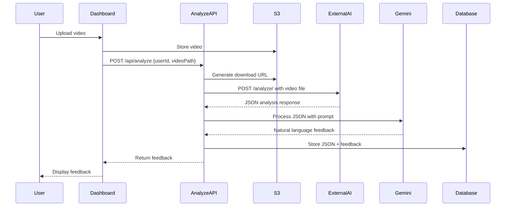
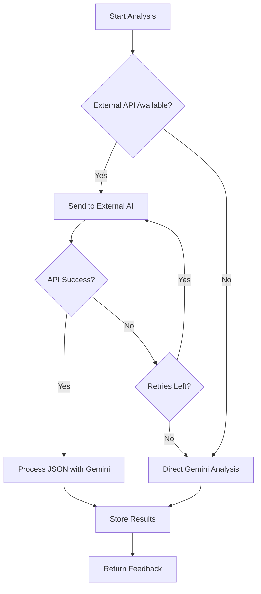

# Design Document: AI Model Integration

## Overview

This design integrates an external AI video analysis model API into the existing Personalized Speaking Coach platform. The integration creates a two-stage analysis pipeline:

1. **Stage 1**: Video is sent to the external AI model API which returns structured JSON analysis
2. **Stage 2**: The JSON analysis is processed by Gemini to generate natural language feedback

This approach leverages specialized video analysis capabilities while maintaining Gemini's strength in generating user-friendly, contextual feedback.

## Architecture

### High-Level Flow

```
User Upload → S3 Storage → External AI Model API → JSON Analysis → Gemini Processing → Feedback Storage → User Display
```

### Component Interaction Diagram



### Fallback Flow



## Components and Interfaces

### 1. External AI Model Client (`lib/externalAIClient.ts`)

**Purpose**: Handle communication with the external AI model API

**Interface**:
```typescript
interface ExternalAIAnalysis {
  // Raw JSON structure from external API
  // Structure will be determined based on actual API response
  [key: string]: any;
}

interface ExternalAIClientConfig {
  apiUrl: string;
  apiKey?: string;
  timeout: number;
  maxRetries: number;
}

class ExternalAIClient {
  constructor(config: ExternalAIClientConfig);
  
  /**
   * Send video to external AI model for analysis
   * @param videoBuffer - Video file as Buffer
   * @param mimeType - Video MIME type (e.g., 'video/mp4')
   * @returns Structured JSON analysis
   */
  async analyzeVideo(
    videoBuffer: Buffer,
    mimeType: string
  ): Promise<ExternalAIAnalysis>;
  
  /**
   * Check if external AI service is available
   */
  async healthCheck(): Promise<boolean>;
}
```

**Implementation Details**:
- Uses `fetch` API with multipart/form-data for video upload
- Implements exponential backoff retry logic (3 attempts)
- Timeout set to 120 seconds for large video processing
- Validates response JSON structure
- Logs all API interactions for monitoring

### 2. Gemini JSON Processor (`lib/geminiProcessor.ts`)

**Purpose**: Convert structured JSON analysis into natural language feedback

**Interface**:
```typescript
interface GeminiProcessorConfig {
  apiKey: string;
  model: string;
}

class GeminiProcessor {
  constructor(config: GeminiProcessorConfig);
  
  /**
   * Process JSON analysis and generate user-friendly feedback
   * @param jsonAnalysis - Structured analysis from external AI
   * @param videoMetadata - Optional video metadata for context
   * @returns Natural language feedback text
   */
  async processFeedback(
    jsonAnalysis: ExternalAIAnalysis,
    videoMetadata?: { duration?: number; fileName?: string }
  ): Promise<string>;
}
```

**Prompt Strategy**:
```
You are a professional speaking coach. You have received detailed analysis data from a video analysis system. 
Convert this technical analysis into warm, constructive feedback for the speaker.

Analysis Data:
{JSON_ANALYSIS}

Provide feedback in the following format:
- **Strengths**: Highlight 2-3 specific positive observations from the data
- **Areas for Improvement**: Provide 2-3 actionable suggestions based on the analysis
- **Overall Assessment**: Brief encouraging summary

Be specific, reference the data points, and maintain an encouraging tone.
```

### 3. Updated Analyze API Route (`app/api/analyze/route.ts`)

**Modified Flow**:
1. Validate request (userId, videoPath)
2. Generate S3 download URL
3. Download video from S3 to Buffer
4. **NEW**: Try external AI analysis
   - Send video to external API
   - Receive JSON response
   - On failure: fall back to direct Gemini
5. **NEW**: Process JSON with Gemini (if external AI succeeded)
6. **FALLBACK**: Direct Gemini video analysis (if external AI failed)
7. Store results in database (both JSON and feedback)
8. Return feedback to client

**Error Handling**:
- External API timeout → Fallback to Gemini
- External API error response → Fallback to Gemini
- Invalid JSON from external API → Fallback to Gemini
- Gemini processing error → Return error to user
- All fallbacks are logged for monitoring

### 4. Database Schema Updates

**Modified `feedback_sessions` table**:
```sql
ALTER TABLE feedback_sessions
ADD COLUMN raw_analysis JSONB,
ADD COLUMN analysis_source VARCHAR(50) DEFAULT 'gemini_direct';

-- analysis_source values: 'external_ai', 'gemini_direct', 'hybrid'
```

**Migration Strategy**:
- Existing records remain unchanged (NULL raw_analysis, 'gemini_direct' source)
- New records populate both columns
- No breaking changes to existing queries

## Data Models

### ExternalAIAnalysis Type

```typescript
// This will be refined based on actual API response structure
interface ExternalAIAnalysis {
  // Example structure - adjust based on actual API
  metadata?: {
    duration: number;
    resolution: string;
    processingTime: number;
  };
  analysis?: {
    speech?: {
      pace?: number;
      clarity?: number;
      fillerWords?: { word: string; count: number }[];
    };
    visual?: {
      bodyLanguage?: string;
      eyeContact?: string;
      gestures?: string;
    };
    overall?: {
      confidence?: number;
      engagement?: number;
    };
  };
  [key: string]: any; // Allow for additional fields
}
```

### Updated FeedbackSession Type

```typescript
export interface FeedbackSession {
  id: string;
  user_id: string;
  video_path: string;
  feedback_text: string | null;
  raw_analysis: ExternalAIAnalysis | null;
  analysis_source: 'external_ai' | 'gemini_direct' | 'hybrid';
  created_at: string;
}
```

## Error Handling

### Error Categories and Responses

| Error Type | HTTP Status | User Message | Action |
|------------|-------------|--------------|--------|
| External API Timeout | 503 | "Analysis in progress..." | Fallback to Gemini |
| External API Error | 503 | "Analysis in progress..." | Fallback to Gemini |
| Invalid JSON Response | 500 | "Analysis in progress..." | Fallback to Gemini |
| Gemini Processing Error | 503 | "Failed to analyze video" | Return error |
| Database Error | 500 | "Failed to save feedback" | Return error |
| Missing Config | 500 | "Service unavailable" | Return error |

### Retry Logic

```typescript
async function withRetry<T>(
  fn: () => Promise<T>,
  maxRetries: number = 3,
  baseDelay: number = 1000
): Promise<T> {
  for (let attempt = 0; attempt < maxRetries; attempt++) {
    try {
      return await fn();
    } catch (error) {
      if (attempt === maxRetries - 1) throw error;
      
      const delay = baseDelay * Math.pow(2, attempt);
      await new Promise(resolve => setTimeout(resolve, delay));
    }
  }
  throw new Error('Max retries exceeded');
}
```

## Testing Strategy

### Unit Tests

1. **ExternalAIClient Tests**
   - Mock fetch responses for success/failure scenarios
   - Test retry logic with failing requests
   - Validate JSON parsing and error handling
   - Test timeout behavior

2. **GeminiProcessor Tests**
   - Mock Gemini API responses
   - Test prompt generation with various JSON structures
   - Validate feedback format and content
   - Test error handling for invalid inputs

3. **Analyze API Tests**
   - Mock external AI and Gemini responses
   - Test fallback logic triggers
   - Validate database operations
   - Test error responses

### Integration Tests

1. **End-to-End Flow**
   - Upload video → External AI → Gemini → Database → Response
   - Test with actual API endpoints (staging environment)
   - Validate data persistence and retrieval

2. **Fallback Scenarios**
   - Simulate external API downtime
   - Verify Gemini fallback activates
   - Confirm user receives feedback

3. **Performance Tests**
   - Measure response times for various video sizes
   - Test concurrent analysis requests
   - Monitor memory usage during video processing

### Manual Testing Checklist

- [ ] Upload video and verify external AI is called
- [ ] Check database for raw_analysis JSON
- [ ] Verify feedback quality from Gemini processing
- [ ] Simulate external API failure and confirm fallback
- [ ] Test with various video formats and sizes
- [ ] Verify error messages are user-friendly
- [ ] Check logs for proper error tracking

## Configuration

### Environment Variables

```bash
# Existing variables
GEMINI_API_KEY=your_gemini_key
AWS_REGION=us-east-1
AWS_ACCESS_KEY_ID=your_key
AWS_SECRET_ACCESS_KEY=your_secret
AWS_S3_BUCKET_NAME=your_bucket

# New variables for external AI
EXTERNAL_AI_API_URL=http://10.89.19.205:9000/analyze/
EXTERNAL_AI_API_KEY=optional_api_key
EXTERNAL_AI_TIMEOUT=120000  # 120 seconds
EXTERNAL_AI_ENABLED=true    # Feature flag
```

### Feature Flag

The integration includes a feature flag (`EXTERNAL_AI_ENABLED`) to:
- Enable/disable external AI without code changes
- Gradually roll out to users
- Quick rollback if issues arise
- A/B testing between direct Gemini and hybrid approach

## Performance Considerations

### Response Time Targets

- External AI analysis: < 60 seconds for 5-minute video
- Gemini processing: < 10 seconds
- Total user wait time: < 75 seconds
- Fallback to direct Gemini: < 90 seconds

### Optimization Strategies

1. **Parallel Processing**: If external API supports it, process video chunks in parallel
2. **Caching**: Cache external AI results for identical videos (future enhancement)
3. **Streaming**: Stream feedback to user as it's generated (future enhancement)
4. **Resource Management**: Clean up temp files and buffers promptly

### Monitoring Metrics

- External API success rate
- Average response times
- Fallback trigger frequency
- User satisfaction with feedback quality
- Error rates by category

## Security Considerations

1. **API Authentication**: Support for API keys if external service requires it
2. **Data Privacy**: Video data is not stored by external service (verify with API provider)
3. **Rate Limiting**: Implement rate limiting to prevent abuse
4. **Input Validation**: Validate video file types and sizes before sending to external API
5. **Secure Communication**: Use HTTPS for external API calls (update URL if needed)

## Migration Plan

### Phase 1: Development (Week 1)
- Implement ExternalAIClient and GeminiProcessor
- Update analyze API route with fallback logic
- Add database migration for new columns
- Write unit tests

### Phase 2: Testing (Week 2)
- Integration testing with actual external API
- Performance testing with various video sizes
- User acceptance testing with sample videos
- Fix bugs and optimize

### Phase 3: Deployment (Week 3)
- Deploy with feature flag disabled
- Run database migration in production
- Enable feature flag for internal testing
- Monitor logs and metrics

### Phase 4: Rollout (Week 4)
- Enable for 10% of users
- Monitor feedback quality and error rates
- Gradually increase to 100%
- Document lessons learned

## Future Enhancements

1. **Detailed Analytics Dashboard**: Visualize raw JSON analysis data for users
2. **Comparison Mode**: Compare multiple presentations side-by-side
3. **Custom Prompts**: Allow users to request specific feedback areas
4. **Real-time Analysis**: Stream analysis results as video is processed
5. **Multi-model Support**: Support multiple external AI providers with routing logic
