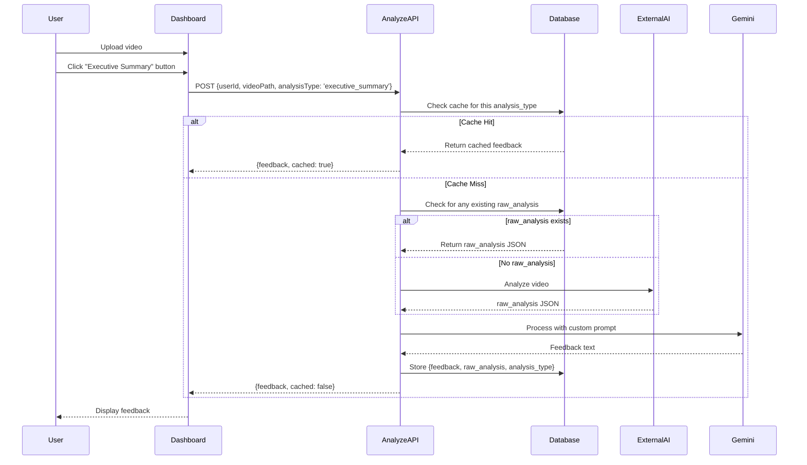

# Design Document: Multi-Button Analysis System

## Overview

This design transforms the single-analysis feedback system into a multi-view analysis platform where users can generate five distinct types of AI-powered feedback from a single video upload. The system uses specialized prompts that process structured JSON data from the external AI model, providing comprehensive insights from different perspectives.

The five analysis types are:
- **Executive Summary (A)**: High-level verdict with quantitative metrics
- **Strengths & Failures (C)**: Honest assessment of what works and what doesn't
- **Timewise Analysis (D)**: 5-second window breakdowns with audio-visual alignment
- **Action Fixes (E)**: Specific, actionable recommendations
- **Visualizations (VIS)**: Textual descriptions of performance patterns

## Architecture

### High-Level Flow

```
User Upload → S3 Storage → First Analysis Request → External AI (raw_analysis JSON)
                                ↓
                         Store raw_analysis
                                ↓
                    Subsequent Analysis Requests → Reuse raw_analysis
                                ↓
                    Gemini with Custom Prompt → Specific Feedback
                                ↓
                    Store with analysis_type → Cache Check on Next Request
```

### Component Interaction Diagram




## Components and Interfaces

### 1. Analysis Prompts Configuration (`lib/analysisPrompts.ts`)

**Purpose**: Centralize all analysis type definitions and their specialized prompts

**Interface**:
```typescript
export type AnalysisType = 
  | 'executive_summary'      // Button A
  | 'strengths_failures'     // Button C
  | 'timewise_analysis'      // Button D
  | 'action_fixes'           // Button E
  | 'visualizations';        // Button VIS

export const ANALYSIS_PROMPTS: Record<AnalysisType, string>;

export function getPromptForAnalysis(
  analysisType: AnalysisType,
  jsonData: any
): string;

export const ANALYSIS_LABELS: Record<AnalysisType, {
  label: string;
  description: string;
}>;
```

**Implementation Details**:
- Each prompt template includes `{json_data}` placeholder for JSON injection
- Prompts are designed to be self-contained and specific to their analysis type
- Labels provide human-readable names and descriptions for UI display
- `getPromptForAnalysis` replaces placeholder with stringified JSON

**Prompt Design Principles**:
1. Clear input format specification (always expects JSON object)
2. Explicit button mode identification
3. Specific output requirements for each type
4. No clarifying questions allowed (must work with provided data)
5. Reasonable defaults if data is missing

### 2. Updated Gemini Processor (`lib/geminiProcessor.ts`)

**New Method**:
```typescript
async processWithPrompt(
  jsonData: any,
  customPrompt: string
): Promise<string>
```

**Purpose**: Accept custom prompts instead of using hardcoded feedback prompt

**Implementation**:
- Takes raw JSON data and custom prompt string
- Sends prompt directly to Gemini without modification
- Returns generated text feedback
- Maintains existing error handling and logging

### 3. Enhanced Analyze API Route (`app/api/analyze/route.ts`)

**Updated Request Interface**:
```typescript
interface AnalyzeRequest {
  userId: string;
  videoPath: string;
  analysisType: AnalysisType;  // NEW
}
```

**Updated Response Interface**:
```typescript
interface AnalyzeResponse {
  success: boolean;
  feedback: string;
  feedbackSessionId: string;
  analysisType: AnalysisType;  // NEW
  cached: boolean;             // NEW
}
```

**Processing Logic**:
1. Validate `analysisType` is one of 5 valid types
2. Check cache: Query database for existing (user_id, video_path, analysis_type)
3. If cached: Return immediately with `cached: true`
4. If not cached:
   a. Check for any existing analysis to get `raw_analysis`
   b. If no `raw_analysis` exists, call external AI
   c. Get appropriate prompt using `getPromptForAnalysis()`
   d. Process with Gemini using `processWithPrompt()`
   e. Store in database with `analysis_type`
5. Return feedback with `cached: false`

**Caching Strategy**:
- First analysis for a video: Calls external AI, stores raw_analysis
- Subsequent analyses (different types): Reuse raw_analysis, only call Gemini
- Same analysis type requested again: Return from cache, no AI calls


### 4. Analysis Button Component (`components/AnalysisButton.tsx`)

**Purpose**: Reusable button component for each analysis type

**Interface**:
```typescript
interface AnalysisButtonProps {
  type: string;
  label: string;
  icon: React.ReactNode;
  description: string;
  onClick: () => void;
  loading: boolean;
  completed: boolean;
  active: boolean;
}
```

**Visual States**:
- **Default**: White/20 border, white/5 background
- **Loading**: Blue border, spinner icon, "Analyzing..." text, disabled
- **Completed**: Green border, checkmark icon, clickable
- **Active**: Blue border, blue/10 background, shadow effect
- **Hover**: Scale 1.02, brighter border (when not loading)

**Accessibility**:
- Focus ring with 2px blue outline
- Disabled state prevents interaction during loading
- Minimum touch target 44px height
- Semantic button element with proper ARIA states

### 5. Updated Dashboard Page (`app/dashboard/page.tsx`)

**New State Management**:
```typescript
const [analysisResults, setAnalysisResults] = useState<Record<AnalysisType, string>>({});
const [loadingStates, setLoadingStates] = useState<Record<AnalysisType, boolean>>({});
const [completedAnalyses, setCompletedAnalyses] = useState<Record<AnalysisType, boolean>>({});
const [activeAnalysisType, setActiveAnalysisType] = useState<AnalysisType | null>(null);
```

**Analysis Handler**:
```typescript
const handleAnalyze = async (analysisType: AnalysisType) => {
  // If already generated, just display it
  if (analysisResults[analysisType]) {
    setActiveAnalysisType(analysisType);
    return;
  }
  
  // Set loading state
  setLoadingStates(prev => ({ ...prev, [analysisType]: true }));
  
  try {
    // Call API with analysis type
    const response = await fetch('/api/analyze', {
      method: 'POST',
      headers: { 'Content-Type': 'application/json', 'Authorization': `Bearer ${token}` },
      body: JSON.stringify({ userId, videoPath, analysisType }),
    });
    
    const data = await response.json();
    
    // Store result
    setAnalysisResults(prev => ({ ...prev, [analysisType]: data.feedback }));
    setCompletedAnalyses(prev => ({ ...prev, [analysisType]: true }));
    setActiveAnalysisType(analysisType);
  } catch (error) {
    // Handle error
  } finally {
    setLoadingStates(prev => ({ ...prev, [analysisType]: false }));
  }
};
```

**UI Layout**:
- Button grid appears after video upload, before any analysis
- Grid uses responsive columns: 1 (mobile), 2 (tablet), 3 (desktop)
- Active analysis feedback displays below button grid
- Switching between analyses is instant (no loading)
- Animations use framer-motion for smooth transitions

### 6. Updated Feedback Card (`components/FeedbackCard.tsx`)

**New Props**:
```typescript
interface FeedbackCardProps {
  feedback: string;
  isLoading?: boolean;
  onSave?: () => void;
  analysisType?: string;      // NEW
  analysisLabel?: string;     // NEW
}
```

**Header Update**:
- Display `analysisLabel` instead of generic "AI Feedback"
- Maintains existing styling and animations
- Falls back to "AI Feedback" if no label provided


## Data Models

### Updated FeedbackSession Type

```typescript
export interface FeedbackSession {
  id: string;
  user_id: string;
  video_path: string;
  feedback_text: string;
  raw_analysis: ExternalAIAnalysis | null;
  analysis_source: 'external_ai' | 'gemini_direct' | 'hybrid';
  analysis_type: AnalysisType;  // NEW
  created_at: string;
}
```

### Database Schema Changes

**Migration SQL**:
```sql
-- Add analysis_type column with default value
ALTER TABLE feedback_sessions 
ADD COLUMN analysis_type TEXT NOT NULL DEFAULT 'executive_summary';

-- Create unique index to prevent duplicate analyses
CREATE UNIQUE INDEX idx_feedback_unique_analysis 
ON feedback_sessions(user_id, video_path, analysis_type);
```

**Index Strategy**:
- Unique constraint on (user_id, video_path, analysis_type) prevents duplicates
- Allows multiple records per video (one per analysis type)
- Efficient lookups for cache checking
- Existing records default to 'executive_summary'

### Analysis Type Enum

```typescript
export type AnalysisType = 
  | 'executive_summary'      // Overall verdict and metrics
  | 'strengths_failures'     // What works and what doesn't
  | 'timewise_analysis'      // 5-second breakdown
  | 'action_fixes'           // Specific improvements
  | 'visualizations';        // Performance patterns
```

## Error Handling

### Validation Errors

| Error Condition | Response | User Message |
|----------------|----------|--------------|
| Invalid analysis_type | 400 | "Invalid analysis type" |
| Missing userId | 400 | "User ID required" |
| Missing videoPath | 400 | "Video path required" |
| Missing analysisType | 400 | "Analysis type required" |

### Cache Errors

| Error Condition | Response | Action |
|----------------|----------|--------|
| Database query fails | Log error | Proceed with new analysis |
| Multiple cache hits | Use first | Log warning |

### Analysis Errors

| Error Condition | Response | User Message |
|----------------|----------|--------------|
| External AI fails (first analysis) | 503 | "Failed to analyze video" |
| Gemini processing fails | 503 | "Failed to generate feedback" |
| Database insert fails | 500 | "Failed to save feedback" |
| No raw_analysis found | Generate new | (transparent to user) |

### UI Error States

- Loading state prevents duplicate requests
- Error messages display in red alert box
- Failed analysis returns button to default state
- User can retry by clicking button again


## Testing Strategy

### Unit Tests

**1. Analysis Prompts (`lib/analysisPrompts.ts`)**
- Test `getPromptForAnalysis` with each analysis type
- Verify JSON data is properly injected into prompt
- Validate all 5 analysis types have prompts defined
- Test ANALYSIS_LABELS completeness

**2. Gemini Processor (`lib/geminiProcessor.ts`)**
- Mock Gemini API for `processWithPrompt` method
- Test with various JSON structures
- Verify error handling for empty responses
- Test with custom prompts

**3. Analyze API Route (`app/api/analyze/route.ts`)**
- Mock database queries for cache checking
- Test cache hit scenario (returns immediately)
- Test cache miss with existing raw_analysis
- Test cache miss without raw_analysis (calls external AI)
- Verify analysis_type validation
- Test unique constraint violation handling

### Integration Tests

**1. End-to-End Analysis Flow**
- Upload video → Generate Executive Summary → Verify storage
- Generate second analysis type → Verify raw_analysis reuse
- Request same analysis type → Verify cache hit
- Verify all 5 analysis types can be generated

**2. Button Interaction Tests**
- Click button → Verify loading state
- Complete analysis → Verify checkmark appears
- Click completed button → Verify instant display
- Switch between analyses → Verify smooth transition

**3. Database Tests**
- Insert multiple analysis types for same video
- Verify unique constraint prevents duplicates
- Query by analysis_type → Verify correct filtering
- Test with missing raw_analysis column (backward compatibility)

### Manual Testing Checklist

- [ ] Upload video and see 5 analysis buttons
- [ ] Click Executive Summary → Verify feedback generation
- [ ] Click Strengths & Failures → Verify different feedback
- [ ] Click Executive Summary again → Verify instant display (cached)
- [ ] Verify all buttons show checkmarks after generation
- [ ] Test responsive grid on mobile, tablet, desktop
- [ ] Verify animations are smooth
- [ ] Test error handling (disconnect network during analysis)
- [ ] Verify loading states work correctly
- [ ] Test with multiple videos (ensure no cross-contamination)


## Performance Considerations

### Response Time Targets

- **Cache Hit**: < 100ms (database query only)
- **Cache Miss (with raw_analysis)**: < 15 seconds (Gemini processing only)
- **Cache Miss (without raw_analysis)**: < 90 seconds (External AI + Gemini)
- **Button State Updates**: < 50ms (instant feedback)
- **Analysis Switching**: < 100ms (instant, no loading)

### Optimization Strategies

**1. Raw Analysis Reuse**
- First analysis: ~90 seconds (external AI + Gemini)
- Subsequent analyses: ~15 seconds (Gemini only)
- Savings: ~75 seconds per additional analysis type

**2. Client-Side Caching**
- Store all generated analyses in React state
- Switching between analyses is instant (no API call)
- Persists until page refresh

**3. Database Indexing**
- Unique index on (user_id, video_path, analysis_type)
- Fast cache lookups with composite index
- Prevents duplicate analysis generation

**4. Parallel Button Rendering**
- All 5 buttons render simultaneously
- No sequential loading or blocking
- Independent loading states per button

### Memory Management

- Raw analysis JSON stored once per video (not per analysis type)
- Client state cleared on page navigation
- Database stores only necessary data (no redundant raw_analysis copies)

## Security Considerations

**1. Input Validation**
- Validate `analysisType` against enum before processing
- Sanitize user inputs (userId, videoPath)
- Prevent SQL injection with parameterized queries

**2. Authorization**
- Verify user owns the video before analysis
- Check session token on every API request
- Prevent cross-user analysis access

**3. Rate Limiting**
- Limit analysis requests per user per hour
- Prevent abuse of external AI API
- Track failed attempts for monitoring

**4. Data Privacy**
- Analysis results tied to user_id
- No sharing of analysis between users
- Secure storage of raw_analysis JSON


## UI/UX Design Details

### Button Grid Layout

**Responsive Breakpoints**:
```css
/* Mobile: 1 column */
@media (max-width: 639px) {
  grid-template-columns: 1fr;
}

/* Tablet: 2 columns */
@media (min-width: 640px) and (max-width: 1023px) {
  grid-template-columns: repeat(2, 1fr);
}

/* Desktop: 3 columns */
@media (min-width: 1024px) {
  grid-template-columns: repeat(3, 1fr);
}
```

**Button Dimensions**:
- Minimum height: 140px
- Padding: 24px (p-6)
- Border radius: 12px (rounded-xl)
- Gap between buttons: 16px (gap-4)

### Visual States

**Default State**:
- Border: 2px solid white/20
- Background: white/5
- Text: slate-300
- Icon background: white/10

**Hover State** (not loading):
- Scale: 1.02
- Border: white/30
- Background: white/10
- Transition: 300ms

**Loading State**:
- Border: 2px solid blue-500
- Background: blue-500/10
- Spinner: Animated blue-400
- Text: "Analyzing..."
- Cursor: not-allowed
- Opacity: 70%

**Completed State**:
- Border: 2px solid green-500/50
- Background: white/5
- Checkmark: Green circle with white check
- Hover: border-green-500, bg-white/10

**Active State** (currently displayed):
- Border: 2px solid blue-500
- Background: blue-500/10
- Shadow: Large blue-500/20
- Icon background: blue-500/20
- Icon color: blue-400

### Animation Specifications

**Button Hover**:
```typescript
whileHover={{ scale: loading ? 1 : 1.02 }}
whileTap={{ scale: loading ? 1 : 0.98 }}
```

**Feedback Card Appearance**:
```typescript
initial={{ opacity: 0, y: 20 }}
animate={{ opacity: 1, y: 0 }}
transition={{ duration: 0.4 }}
```

**Button Grid Appearance**:
```typescript
initial={{ opacity: 0, y: 20 }}
animate={{ opacity: 1, y: 0 }}
transition={{ duration: 0.4 }}
```

### Icon Mapping

- **Executive Summary**: `<BarChart3 />` (lucide-react)
- **Strengths & Failures**: `<Scale />` (lucide-react)
- **Timewise Analysis**: `<Clock />` (lucide-react)
- **Action Fixes**: `<Wrench />` (lucide-react)
- **Visualizations**: `<TrendingUp />` (lucide-react)

### Accessibility Features

- Focus ring: 2px blue-400 with offset
- Keyboard navigation: Tab through buttons
- Screen reader labels: Button text + description
- Disabled state: Prevents interaction during loading
- Minimum touch target: 44px height
- Color contrast: WCAG AA compliant


## Implementation Phases

### Phase 1: Foundation (Database & Types)
- Run database migration for `analysis_type` column
- Update `lib/types.ts` with `AnalysisType` enum
- Create `lib/analysisPrompts.ts` with all 5 prompts
- Test prompt generation with sample JSON

### Phase 2: Backend Logic (API & Processing)
- Add `processWithPrompt` method to `lib/geminiProcessor.ts`
- Update `/app/api/analyze/route.ts` with caching logic
- Implement analysis type validation
- Test cache hit/miss scenarios

### Phase 3: UI Components (Buttons & Display)
- Create `components/AnalysisButton.tsx`
- Update `app/dashboard/page.tsx` with button grid
- Add state management for multiple analyses
- Implement `handleAnalyze` function

### Phase 4: Integration & Polish
- Update `components/FeedbackCard.tsx` with analysis type display
- Test all 5 analysis types end-to-end
- Verify responsive layout on all devices
- Polish animations and transitions

### Phase 5: Testing & Validation
- Unit tests for all new functions
- Integration tests for analysis flow
- Manual testing checklist completion
- Performance validation

## Success Metrics

### Functional Requirements
- ✅ 5 buttons display after video upload
- ✅ Each button triggers unique analysis with correct prompt
- ✅ Results are cached (no re-generation on second click)
- ✅ Loading states work per button
- ✅ Completed buttons show checkmark
- ✅ Active button has highlighted border
- ✅ Can switch between completed analyses instantly
- ✅ Mobile responsive grid layout
- ✅ Smooth animations

### Performance Metrics
- Cache hit response time < 100ms
- First analysis < 90 seconds
- Subsequent analyses < 15 seconds
- Button state updates < 50ms
- Analysis switching < 100ms

### User Experience
- Clear visual feedback for all states
- No confusion about which analysis is displayed
- Easy switching between analysis types
- Responsive on all device sizes
- Accessible to keyboard and screen reader users

## Future Enhancements

1. **Analysis Comparison View**: Side-by-side comparison of multiple analysis types
2. **Export Functionality**: Download all analyses as PDF or JSON
3. **Custom Prompts**: Allow users to create their own analysis types
4. **Analysis History**: View previous analyses for the same video
5. **Batch Analysis**: Generate all 5 analyses with one click
6. **Analysis Sharing**: Share specific analysis types with others
7. **Analysis Annotations**: Add notes or highlights to feedback
8. **Progress Tracking**: Track improvement across multiple videos
