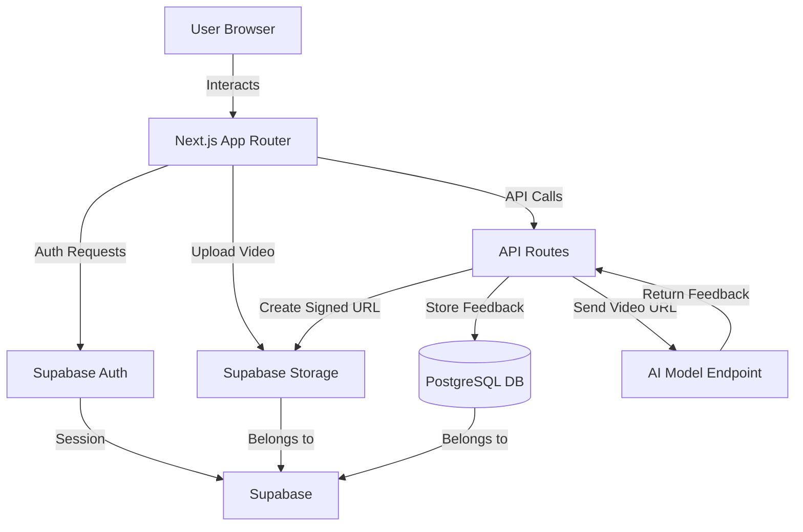

# Design Document

## Overview

The Personalized Speaking Coach MVP is a Next.js application using the App Router architecture, Tailwind CSS for styling, and Supabase as the backend-as-a-service platform. The application follows a client-server architecture where the Next.js frontend handles user interactions and the backend API routes orchestrate communication between Supabase and an external AI model endpoint.

The core flow is: User authenticates → Uploads MP4 video → Triggers analysis → Receives AI feedback → Views formatted results.

## Architecture

### High-Level Architecture



### Technology Stack

- **Frontend Framework**: Next.js 14+ (App Router with TypeScript)
- **Styling**: Tailwind CSS v3+
- **Backend**: Next.js API Routes (serverless functions)
- **Authentication**: Supabase Auth (email/password + Google OAuth)
- **Database**: Supabase PostgreSQL
- **Storage**: Supabase Storage (object storage for videos)
- **AI Integration**: External REST API endpoint
- **Deployment**: Vercel (frontend + API routes)

### Folder Structure

```
/app
  /page.tsx                      # Landing/login page
  /dashboard
    /page.tsx                    # Main dashboard with upload & feedback
  /api
    /analyze
      /route.ts                  # Analysis API endpoint
/components
  /UploadBox.tsx                 # Drag-and-drop upload component
  /FeedbackCard.tsx              # Feedback display component
  /VideoPreview.tsx              # Video player component
  /UploadHistory.tsx             # Recent uploads list (optional)
/lib
  /supabaseClient.ts             # Supabase client initialization
  /supabaseServer.ts             # Server-side Supabase client
  /types.ts                      # TypeScript type definitions
/utils
  /validation.ts                 # File validation utilities
tailwind.config.js               # Tailwind configuration
.env.local                       # Environment variables
```

## Components and Interfaces

### Frontend Components

#### 1. Landing Page (`/app/page.tsx`)

**Purpose**: Entry point for unauthenticated users

**Features**:
- Hero section with app description
- Login/signup forms using Supabase Auth
- Google OAuth button
- Redirect to dashboard if already authenticated

**State Management**:
- Uses Supabase Auth session state
- Redirects on successful authentication

#### 2. Dashboard Page (`/app/dashboard/page.tsx`)

**Purpose**: Main application interface for authenticated users

**Features**:
- Upload section with UploadBox component
- Video preview after upload
- "Analyze Video" button
- FeedbackCard component for displaying results
- Optional: UploadHistory component

**State Management**:
```typescript
interface DashboardState {
  uploadedVideo: {
    path: string;
    url: string;
  } | null;
  isUploading: boolean;
  uploadProgress: number;
  isAnalyzing: boolean;
  feedback: string | null;
  error: string | null;
}
```

#### 3. UploadBox Component (`/components/UploadBox.tsx`)

**Purpose**: Handle video file selection and upload

**Props**:
```typescript
interface UploadBoxProps {
  onUploadComplete: (videoPath: string, videoUrl: string) => void;
  onUploadProgress: (progress: number) => void;
  onError: (error: string) => void;
}
```

**Features**:
- Drag-and-drop zone with visual feedback
- File picker button
- File validation (MP4 format, <150MB)
- Progress bar during upload
- Upload to Supabase Storage with path: `user_{userId}/{timestamp}.mp4`

**Validation Logic**:
```typescript
const validateFile = (file: File): { valid: boolean; error?: string } => {
  if (file.type !== 'video/mp4') {
    return { valid: false, error: 'Only MP4 files are supported' };
  }
  if (file.size > 150 * 1024 * 1024) {
    return { valid: false, error: 'File size must be less than 150MB' };
  }
  return { valid: true };
};
```

#### 4. FeedbackCard Component (`/components/FeedbackCard.tsx`)

**Purpose**: Display AI-generated feedback

**Props**:
```typescript
interface FeedbackCardProps {
  feedback: string;
  isLoading: boolean;
  onSave?: () => void;
}
```

**Features**:
- Animated fade-in entrance
- Formatted text display with proper line breaks
- "AI Feedback" title
- Optional save button
- Responsive design

#### 5. VideoPreview Component (`/components/VideoPreview.tsx`)

**Purpose**: Display uploaded video

**Props**:
```typescript
interface VideoPreviewProps {
  videoUrl: string;
  videoPath: string;
}
```

**Features**:
- HTML5 video player with controls
- Responsive sizing
- Fallback for unsupported formats

### Backend API Routes

#### `/api/analyze/route.ts`

**Purpose**: Orchestrate video analysis workflow

**Request Format**:
```typescript
interface AnalyzeRequest {
  userId: string;
  videoPath: string;
}
```

**Response Format**:
```typescript
interface AnalyzeResponse {
  success: boolean;
  feedback?: string;
  error?: string;
}
```

**Workflow**:
1. Validate request body (userId, videoPath)
2. Create signed URL from Supabase Storage (10-minute expiration)
3. POST to AI model endpoint with signed URL
4. Receive feedback from AI model
5. Store feedback in `feedback_sessions` table
6. Return feedback to client

**Implementation Pattern**:
```typescript
export async function POST(request: Request) {
  try {
    // 1. Parse and validate request
    const { userId, videoPath } = await request.json();
    
    // 2. Create signed URL
    const { data: signedUrlData, error: urlError } = await supabase
      .storage
      .from('videos')
      .createSignedUrl(videoPath, 600); // 10 minutes
    
    // 3. Call AI model
    const aiResponse = await fetch(AI_MODEL_ENDPOINT, {
      method: 'POST',
      headers: { 'Content-Type': 'application/json' },
      body: JSON.stringify({ videoUrl: signedUrlData.signedUrl })
    });
    
    const { feedback } = await aiResponse.json();
    
    // 4. Store in database
    const { error: dbError } = await supabase
      .from('feedback_sessions')
      .insert({
        user_id: userId,
        video_path: videoPath,
        feedback_text: feedback
      });
    
    // 5. Return response
    return Response.json({ success: true, feedback });
  } catch (error) {
    return Response.json({ success: false, error: error.message }, { status: 500 });
  }
}
```

### Supabase Client Configuration

#### Client-Side (`/lib/supabaseClient.ts`)

```typescript
import { createClient } from '@supabase/supabase-js';

const supabaseUrl = process.env.NEXT_PUBLIC_SUPABASE_URL!;
const supabaseAnonKey = process.env.NEXT_PUBLIC_SUPABASE_ANON_KEY!;

export const supabase = createClient(supabaseUrl, supabaseAnonKey);
```

#### Server-Side (`/lib/supabaseServer.ts`)

```typescript
import { createClient } from '@supabase/supabase-js';

const supabaseUrl = process.env.NEXT_PUBLIC_SUPABASE_URL!;
const supabaseServiceKey = process.env.SUPABASE_SERVICE_ROLE_KEY!;

export const supabaseServer = createClient(supabaseUrl, supabaseServiceKey);
```

## Data Models

### Database Schema

#### `feedback_sessions` Table

```sql
create table feedback_sessions (
  id uuid primary key default gen_random_uuid(),
  user_id uuid references auth.users(id) not null,
  video_path text not null,
  feedback_text text,
  created_at timestamptz default now()
);

-- Index for faster queries by user
create index idx_feedback_sessions_user_id on feedback_sessions(user_id);

-- Index for ordering by creation time
create index idx_feedback_sessions_created_at on feedback_sessions(created_at desc);
```

#### Row Level Security (RLS) Policies

```sql
-- Enable RLS
alter table feedback_sessions enable row level security;

-- Users can only read their own feedback
create policy "Users can view own feedback"
  on feedback_sessions for select
  using (auth.uid() = user_id);

-- Users can insert their own feedback (via API)
create policy "Users can insert own feedback"
  on feedback_sessions for insert
  with check (auth.uid() = user_id);
```

### Supabase Storage

#### Bucket Configuration

- **Bucket Name**: `videos`
- **Public Access**: No (private bucket)
- **File Size Limit**: 150MB (enforced client-side)
- **Allowed MIME Types**: `video/mp4`

#### Storage Policies

```sql
-- Users can upload to their own folder
create policy "Users can upload own videos"
  on storage.objects for insert
  with check (
    bucket_id = 'videos' and
    (storage.foldername(name))[1] = concat('user_', auth.uid()::text)
  );

-- Users can read their own videos
create policy "Users can read own videos"
  on storage.objects for select
  using (
    bucket_id = 'videos' and
    (storage.foldername(name))[1] = concat('user_', auth.uid()::text)
  );
```

### TypeScript Types

```typescript
// /lib/types.ts

export interface User {
  id: string;
  email: string;
}

export interface FeedbackSession {
  id: string;
  user_id: string;
  video_path: string;
  feedback_text: string | null;
  created_at: string;
}

export interface UploadedVideo {
  path: string;
  url: string;
  timestamp: number;
}

export interface AIModelRequest {
  videoUrl: string;
}

export interface AIModelResponse {
  feedback: string;
}
```

## Error Handling

### Client-Side Error Handling

**Upload Errors**:
- Invalid file format → Display toast: "Only MP4 files are supported"
- File too large → Display toast: "File must be less than 150MB"
- Upload failure → Display toast: "Upload failed. Please try again"

**Analysis Errors**:
- API failure → Display toast: "Analysis failed. Please try again"
- Network timeout → Display toast: "Request timed out. Please check your connection"

**Authentication Errors**:
- Invalid credentials → Display inline error: "Invalid email or password"
- Session expired → Redirect to login with message: "Session expired. Please log in again"

### Server-Side Error Handling

**API Route Error Responses**:

```typescript
// 400 Bad Request - Invalid input
{
  success: false,
  error: "Missing required fields: userId, videoPath"
}

// 401 Unauthorized - Authentication failure
{
  success: false,
  error: "Unauthorized: Invalid or expired session"
}

// 500 Internal Server Error - Server/external service failure
{
  success: false,
  error: "Failed to process video analysis"
}

// 503 Service Unavailable - AI model endpoint down
{
  success: false,
  error: "AI service temporarily unavailable"
}
```

**Error Logging**:
- Use `console.error()` for server-side errors
- Include error context (userId, videoPath, timestamp)
- Consider integrating error tracking service (e.g., Sentry) for production

## Testing Strategy

### Unit Testing

**Components to Test**:
- File validation logic in UploadBox
- Feedback formatting in FeedbackCard
- Supabase client initialization

**Testing Framework**: Jest + React Testing Library

**Example Test Cases**:
```typescript
describe('validateFile', () => {
  it('should accept valid MP4 files under 150MB', () => {
    const file = new File([''], 'test.mp4', { type: 'video/mp4' });
    Object.defineProperty(file, 'size', { value: 100 * 1024 * 1024 });
    expect(validateFile(file).valid).toBe(true);
  });

  it('should reject non-MP4 files', () => {
    const file = new File([''], 'test.avi', { type: 'video/avi' });
    expect(validateFile(file).valid).toBe(false);
  });

  it('should reject files over 150MB', () => {
    const file = new File([''], 'test.mp4', { type: 'video/mp4' });
    Object.defineProperty(file, 'size', { value: 200 * 1024 * 1024 });
    expect(validateFile(file).valid).toBe(false);
  });
});
```

### Integration Testing

**API Route Testing**:
- Test `/api/analyze` with mock Supabase and AI endpoint
- Verify signed URL creation
- Verify database insertion
- Test error scenarios (missing fields, external service failures)

**Authentication Flow Testing**:
- Test login with valid credentials
- Test OAuth flow (manual testing)
- Test protected route access

### End-to-End Testing

**Critical User Flows**:
1. Complete authentication flow
2. Upload video → Analyze → View feedback
3. Error handling for invalid uploads

**Testing Framework**: Playwright or Cypress

**Example E2E Test**:
```typescript
test('complete video analysis flow', async ({ page }) => {
  // Login
  await page.goto('/');
  await page.fill('[name="email"]', 'test@example.com');
  await page.fill('[name="password"]', 'password123');
  await page.click('button[type="submit"]');
  
  // Upload video
  await page.setInputFiles('input[type="file"]', 'test-video.mp4');
  await page.waitForSelector('text=Uploaded Successfully');
  
  // Analyze
  await page.click('button:has-text("Analyze Video")');
  await page.waitForSelector('text=AI Feedback');
  
  // Verify feedback displayed
  const feedback = await page.textContent('[data-testid="feedback-text"]');
  expect(feedback).toBeTruthy();
});
```

## UI/UX Design Patterns

### Design System

**Color Palette**:
- Primary: Indigo/Blue gradient (`from-indigo-500 to-blue-600`)
- Success: Green (`green-500`)
- Error: Red (`red-500`)
- Background: Light gray (`gray-50`) / Dark (`gray-900` for dark mode)
- Text: Dark gray (`gray-900`) / Light (`gray-100` for dark mode)

**Typography**:
- Headings: `font-bold text-2xl` to `text-4xl`
- Body: `text-base` or `text-lg`
- Font family: Default Tailwind (system fonts)

**Spacing**:
- Container padding: `p-6` or `p-8`
- Component gaps: `gap-4` or `gap-6`
- Section margins: `my-8` or `my-12`

### Component Styling

**UploadBox**:
```tsx
<div className="border-2 border-dashed border-gray-300 rounded-lg p-12 text-center hover:border-indigo-500 transition-colors cursor-pointer">
  <CloudUploadIcon className="mx-auto h-12 w-12 text-gray-400" />
  <p className="mt-2 text-sm text-gray-600">
    Drag and drop your MP4 file here, or click to browse
  </p>
</div>
```

**FeedbackCard**:
```tsx
<div className="bg-white rounded-lg shadow-lg p-6 animate-fade-in">
  <h3 className="text-xl font-bold text-gray-900 mb-4">AI Feedback</h3>
  <div className="prose prose-sm text-gray-700">
    {feedback}
  </div>
  <button className="mt-4 px-4 py-2 bg-indigo-600 text-white rounded-md hover:bg-indigo-700">
    Save
  </button>
</div>
```

**Progress Bar**:
```tsx
<div className="w-full bg-gray-200 rounded-full h-2">
  <div 
    className="bg-indigo-600 h-2 rounded-full transition-all duration-300"
    style={{ width: `${progress}%` }}
  />
</div>
```

### Responsive Design

- Mobile-first approach using Tailwind breakpoints
- Stack components vertically on mobile (`flex-col`)
- Side-by-side layout on desktop (`md:flex-row`)
- Adjust padding and font sizes for smaller screens

### Animations

**Fade-in Animation** (Tailwind config):
```javascript
// tailwind.config.js
module.exports = {
  theme: {
    extend: {
      animation: {
        'fade-in': 'fadeIn 0.5s ease-in-out',
      },
      keyframes: {
        fadeIn: {
          '0%': { opacity: '0', transform: 'translateY(10px)' },
          '100%': { opacity: '1', transform: 'translateY(0)' },
        },
      },
    },
  },
};
```

## Security Considerations

### Authentication
- Use Supabase Auth with secure session management
- Store tokens in httpOnly cookies (Supabase default)
- Implement session refresh logic

### Authorization
- Enforce Row Level Security (RLS) on all database tables
- Validate user ownership in API routes
- Use service role key only in server-side code

### File Upload Security
- Validate file type and size on both client and server
- Use private storage bucket (no public access)
- Generate signed URLs with short expiration (10 minutes)
- Sanitize file names to prevent path traversal

### API Security
- Validate all input parameters
- Use environment variables for sensitive credentials
- Implement rate limiting (consider Vercel's built-in limits)
- Sanitize error messages (don't expose internal details)

### Environment Variables

```env
# .env.local
NEXT_PUBLIC_SUPABASE_URL=https://your-project.supabase.co
NEXT_PUBLIC_SUPABASE_ANON_KEY=your-anon-key
SUPABASE_SERVICE_ROLE_KEY=your-service-role-key
AI_MODEL_ENDPOINT=https://your-model-endpoint.com/analyze
```

## Deployment

### Vercel Deployment

**Steps**:
1. Connect GitHub repository to Vercel
2. Configure environment variables in Vercel dashboard
3. Deploy with automatic builds on push to main branch

**Configuration**:
- Framework: Next.js
- Build command: `next build`
- Output directory: `.next`
- Node version: 18.x or higher

### Supabase Setup

**Steps**:
1. Create new Supabase project
2. Run database migrations for `feedback_sessions` table
3. Create `videos` storage bucket
4. Configure RLS policies
5. Enable Google OAuth in Authentication settings
6. Copy project URL and keys to environment variables

## Performance Optimization

### Video Upload
- Use Supabase Storage's built-in chunked upload for large files
- Display progress feedback to improve perceived performance
- Compress videos client-side if needed (future enhancement)

### API Response Time
- Use signed URLs to avoid proxying video data through API
- Implement caching for repeated analysis requests (future enhancement)
- Consider background job processing for long-running analysis

### Frontend Performance
- Lazy load components not immediately visible
- Use Next.js Image component for any images
- Minimize bundle size by tree-shaking unused Tailwind classes
- Use React.memo for expensive components

## Future Enhancements

While not part of the MVP, these enhancements could be considered:

1. **Webcam Recording**: Allow users to record directly in the browser
2. **Advanced Analytics**: Track metrics like word count, filler words, speaking rate
3. **Progress Tracking**: Visualize improvement over time with charts
4. **Feedback History**: Full history with search and filtering
5. **Export Options**: Download feedback as PDF or TXT
6. **Collaborative Features**: Share videos with coaches or peers
7. **Mobile App**: Native iOS/Android apps
8. **Real-time Analysis**: Stream analysis results as they're generated
